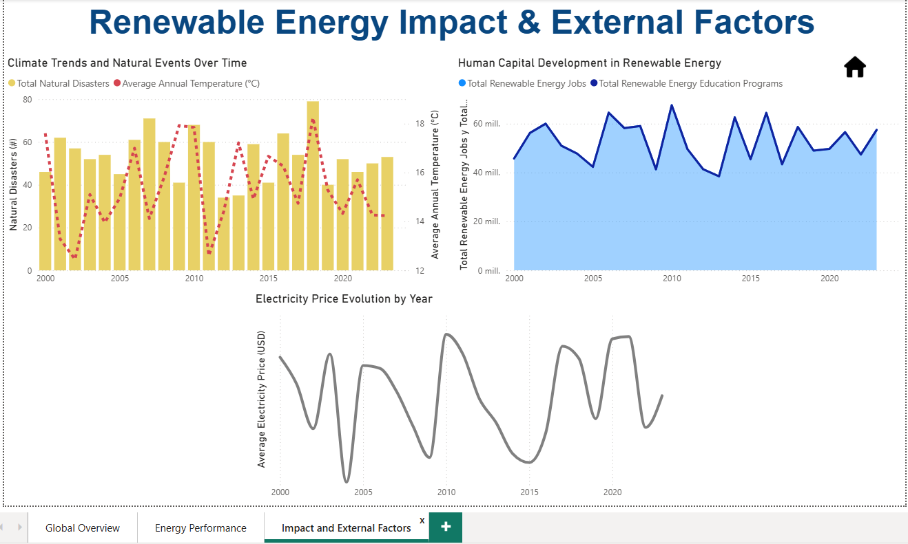

# Global Renewable Energy Dashboard
## 1. Project Overview

This Power BI dashboard analyzes global renewable energy trends, investments, CO2 emissions, and human capital development across countries over the last 20 years.

### Objectives:

Provide a clear overview of renewable energy adoption worldwide.

Highlight efficiency, investments, and environmental impact by country and energy type.

Support strategic decisions with actionable insights.

### Data Source:

Kaggle: Global Renewable Energy and Indicators Dataset

Dataset: ~2,500 rows, 50+ columns covering:

- Country-level renewable energy production

- Socio-economic & environmental indicators

- Human capital and innovation metrics

**Data Import from Kaggle -  .CSV file**

## 2. Data Cleaning/Transformation (in Power Query)

- Correct data types (decimal, integer, text) 

- Normalize columns (e.g., date formats, uppercase/lowercase)

- Handle nulls and errors if any (in this dataset there are none) 

- Remove or consolidate duplicates if any (in this dataset there are none)

## 3. Data Modeling (Star Schema)

- Create Fact Table and Dimension Tables
- Generate primary keys and relationships (1:N, filter directions, etc.)
- Validate table and relationship integrity

**Fact Table: FactRenewables**

Stores numeric measures: Production (GWh), Installed Capacity (MW), Investments, CO2 Emissions, Renewable Energy Jobs, Exports/Imports

**Dimension Tables:**

- Dim_Country: Country, Government Policies, Political Stability, Regulatory Quality, Rule of Law, Control of Corruption, Ease of Doing Business, Public-Private Partnerships, Regional Cooperation

- Dim_EnergyType: Energy Type

- Dim_Environment: Temperature, Rainfall, Solar Irradiance, Wind Speed, Hydro & Geothermal Potential, Biomass Availability

- Dim_Economy: Population, GDP, Energy Consumption, Investment-to-GDP Ratio

- Dim_Innovation: R&D Expenditure, Renewable Energy Targets, Renewable Energy Patents, Research Institutions

Rationale:

- 1-to-many relationships enable proper aggregation and filtering

- Prevents duplicate counting

- Supports accurate DAX calculations

## 3. DAX Measures & KPIs

All KPIs created as **explicit measures** in FactRenewables.

## 4. Dashboard Pages Overview

**Page 1: Global Overview**

Title: **Global Renewable Energy Dashboard**

Slicers: Country, Energy Type, Year

KPIs: Total Production, Installed Capacity, Total Investment, Investment per Capita, Avg CO2, CO2 per GWh, Jobs per MW

**Charts:**

1. Line Chart: Avg Energy Production vs Consumption per Year

2. Bar Chart (%): Total Energy Exports vs Imports per Country

**Page 2: Energy Performance**

**Charts:**

1. Top Renewable Energy Sources by Production (Bar Chart)

2. Trends Over Time by Energy Type (Line)

3. CO2 per GWh by Energy Type & Country (Bar Chart)

4. Investment vs Production Efficiency (Scatter Plot)

**Page 3: Renewable Energy Impact & External Factors**

**Charts:**

1. Climate Trends & Natural Events (Combo Chart: Temp Line / Natural Disasters Bars)

2. Human Capital Development: Jobs & Education Programs (Area Chart)

3. Electricity Prices Over Time (Line)

## 5. Insights & Highlights

- Trends: Increasing solar & wind production worldwide

- Human capital: Development lags in some regions despite high investments

- CO2 per GWh: Highlights cleaner energy producers

## 6. Future Improvements

- Add rich tooltips for Government Policies, Public Awareness, and Public-Private Partnerships

- Conditional formatting for KPIs and charts

- Dynamic drill-throughs to explore country-specific trends

- Include additional ratio-based metrics and scatter plots for deeper insights

## 7. Skills Showcased

- **Power BI Desktop**: Data import, Power Query transformations

- **Data Modeling**: Star schema design, fact & dimension tables

- **DAX**: Explicit measures, such as: CO2 per GWh, Investment per Capita, Jobs per MW

- **Visualization**: Line, Area, Bar, Combo, Scatter charts

- **Interactive dashboards**: Slicers, filters

- **Analytical thinking**: KPI selection and definition, energy efficiency, human capital assessment

## 8. Dashboard Overview (Suggested Visuals)

Example:

- Page 1: Global Overview – slicers + KPIs + line & bar charts

- Page 2: Energy Performance – top energy sources, trends, CO2 efficiency, scatter plot

- Page 3: Impact & External Factors – climate trends, electricity prices, human capital

## 9. Lessons Learned 

- Learned to clean and transform a large dataset in Power Query, correcting data types, handling formatting issues, and removing duplicates.

- Understood the importance of Star Schema modeling for accurate and efficient relationships between fact and dimension tables.

- Gained practical experience creating explicit DAX measures for KPIs and understanding when to use averages vs sums.

- Improved skills in dashboard design and visual storytelling, including slicers, KPIs, combo charts, tooltips, and drill-through.

- Learned to validate data integrity and relationships to prevent misleading visuals.

- Understood how to design dashboards for insights rather than just showing totals (e.g., CO2 per GWh, jobs per MW, investment efficiency).

- Gained experience in documenting a project thoroughly for a GitHub portfolio, including workflow, measures, KPIs, and dashboard objectives.

Note: The dataset was also explored in Python independently for statistical insights.
In a real-world pipeline, the data cleaning and transformation would ideally be integrated before Power BI import.
